# python_labb
## Лабораторная работа 1

### Задание 1
```python
name = input("")  
age = int(input(""))  
print(f"Привет, {name}! Через год тебе будет {age + 1}.")
```
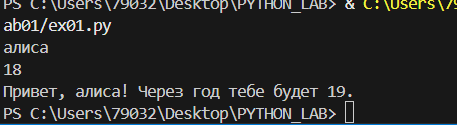

### Задание 2
```python
a = input("")
if ',' in a: a = a.replace(',','.')
b = input("")
if ',' in b: b = b.replace(',','.')
floata = float(a)
floatb = float(b)

Sum = floata + floatb
Average = Sum / 2

print(f'sum = {Sum:.2f}; avg = {Average:.2f}')
```
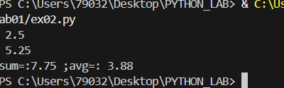

### Задание 3
```python
price = input('')
discount = input('')
vat = input('')
base = int(price) * (1 - int(discount)/100)
vat_amount = base * (int(vat)/100)
total = base + vat_amount
print(f'База после скидки: {base:.2f}.', f'НДС: {vat_amount:.2f}.', f'Итого к оплате: {total:.2f}.', sep='\n')
```
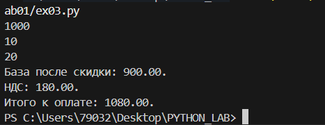

### Задание 4
```python
minutes = input('')
m = int(minutes)
h = m // 60
ost = m % 60
print(f'{h}:{ost}')
```
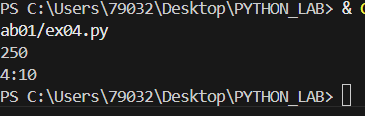

### Задание 5
```python
FIO = input('').strip()
FIO2 = ' '.join(FIO.split())
initials = ''.join([w[0].upper() for w in FIO2.split()])
print(f'{initials}.')
print(f'{len(FIO2)}')
```
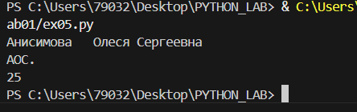

### Задание 6
```python
def count_participants():  
    n = int(input(""))
      
    offline = 0  
    online = 0  
      
    for _ in range(n):  
        data = input().split()  
          
        participation_format = data[-1] == 'True'  
         
        if participation_format:  
            offline += 1  
        else:  
            online += 1 
    
    print(f" {offline}", f" {online}", sep=" ")  
  
count_participants()
```
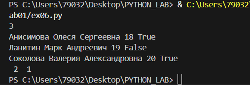

### Задание 7
```python
ex = "thisisabracadabraHt1eadljjl12ojh."
def res_str(s):
    
    for i, ch in enumerate(s):
        if ch.isupper():
            start = i
            break
    else:
        return None  
    
    for i, ch in enumerate(s):
        if ch.isdigit() and i + 1 < len(s):
            step = (i + 1) - start
            if step <= 0:
                continue
            
            result = []
            pos = start
            while pos < len(s):
                result.append(s[pos])
                if s[pos] == '.':
                    return ''.join(result)
                pos += step
    
    return None
    
print(res_str(ex))
```
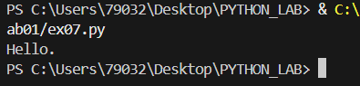

## Лабораторная работа 2

### Задание 1
```python
def min_max(nums):
    if isinstance(nums, list) and len(nums) != 0 and all(isinstance(element, (int, float)) for element in nums):
        return min(nums), max(nums)
    return 'ValueError'

print('min_max')
print(min_max([3, -1, 5, 6, 0]))
print(min_max([52]))
print(min_max([-5, -2, -9]))
print(min_max([]))
print(min_max([2.5, -2, 2.1, 3.1]))

def unique_sorted(nums):
    if isinstance(nums, list) and len(nums) != 0 and all(isinstance(element, (int, float)) for element in nums):
        return sorted(set(nums))
    return nums

print('unique_sorted')
print(unique_sorted([3, 2, 2, 1, 3]))
print(unique_sorted([]))
print(unique_sorted([-1, -1, 0, 2, 2]))
print(unique_sorted([1.0, 1, 2.6, 2.4, 0]))

def flatten(mat):
    if isinstance(mat, (list, tuple)) and len(mat) != 0 and all(isinstance(element, (list, tuple)) for element in mat):
        result = []
        for element in mat:
            result.extend(element)
        return result
    return 'TypeError'

print('flatten')
print(flatten([[2, 3], [4, 5]]))
print(flatten(([2, 3], (4, 5, 6))))
print(flatten([[1], [], [2, 3]]))
print(flatten([[1, 2], "gg"]))
```
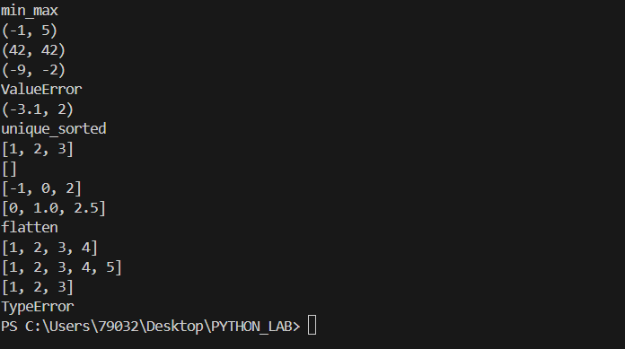

### Задание B
```python
def transpose(mat):
    if len(mat) == 0:
        return []
    if isinstance(mat, list) and all(isinstance(row, list) for row in mat) and all(isinstance(element, (int, float)) for row in mat for element in row):
        row_len = [len(row) for row in mat]
        if len(set(row_len)) != 1:
            return 'ValueError'

        return [[mat[j][i] for j in range(len(mat))] for i in range(len(mat[0]))]

print('transpose')
print(transpose([[1, 2, 3]]))
print(transpose([[1], [2], [3]]))
print(transpose([[1, 2], [3, 4]]))
print(transpose([]))
print(transpose([[1, 2], [3]]))


def row_sums(mat):
    if len(mat) == 0:
        return []
    if isinstance(mat, list) and all(isinstance(row, list) for row in mat) and all(isinstance(element, (int, float)) for row in mat for element in row):
        row_len = [len(row) for row in mat]
        if len(set(row_len)) != 1:
            return 'ValueError'
        return [sum(element) for element in mat]

print('row_sums')
print(row_sums([[1, 2, 3], [4, 5, 6]]))
print(row_sums([[-1, 1], [10, -10]]))
print(row_sums([[0, 0], [0, 0]]))
print(row_sums([[1, 2], [3]]))


def col_sums(mat):
    if len(mat) == 0:
        return []
    if isinstance(mat, list) and all(isinstance(row, list) for row in mat) and all(isinstance(element, (int, float)) for row in mat for element in row):
        row_len = [len(row) for row in mat]
        if len(set(row_len)) != 1:
            return 'ValueError'
    result = []
    for col_index in range(len(mat[0])):
        sum_col = 0
        for row in mat:
            sum_col += row[col_index]
        result.append(sum_col)
    return result

print('col_sums')
print(col_sums([[1, 2, 3], [4, 5, 6]]))
print(col_sums([[-1, 1], [10, -10]]))
print(col_sums([[0, 0], [0, 0]]))
print(col_sums([[1, 2], [3]]))
```
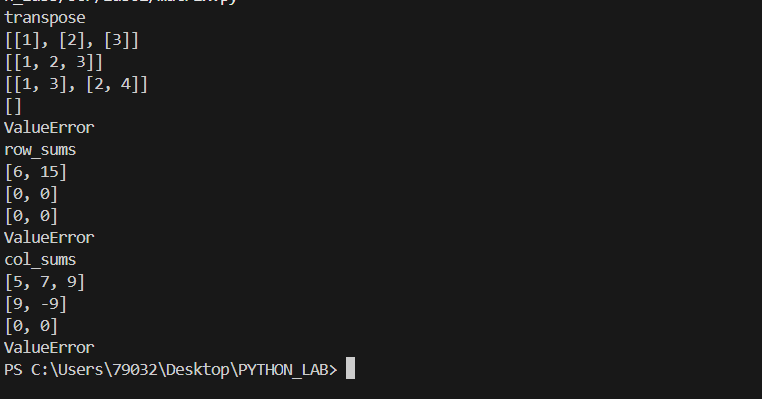

### Задание C
```python
def format_record(rec):
    if len(rec[0]) == 0 or len(rec[1]) == 0:
        return 'ValueError'
    if type(rec[2]) is not float:
        return 'TypeError'
    if isinstance(rec, tuple):
        if isinstance(rec[0], str) and isinstance(rec[1], str) and isinstance(rec[2], float):
            name = rec[0].split()
            full_name = name[0][0].upper() + name[0][1:] + ' '
            for initials in name[1:]:
                full_name += initials[0].upper() + '.'
            return f'{full_name}, гр. {rec[1]}, GPA {"{:.2f}".format(rec[2])}'

print(format_record(("Иванов Иван Иванович", "BIVT-25", 4.6)))
print(format_record(("Петров Пётр", "IKBO-12", 5.0)))
print(format_record(("Петров Пётр Петрович", "IKBO-12", 5.0)))
print(format_record(("  сидорова  анна   сергеевна ", "ABB-01", 3.999)))
```
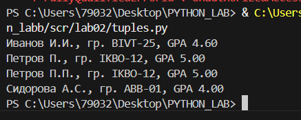

## Лабораторная работа 3
### Задание A
```python
import re

def normalize(text: str, *, casefold: bool = True, yo2e: bool = True) -> str:

    result = text
    if yo2e:
        result = result.replace('ё', 'е').replace('Ё', 'Е')
    if casefold:
        result = result.casefold()
    result = re.sub(r'\s+', ' ', result)
    return result.strip()

print("normalize")
print(normalize('ПрИвЕт\nМИр\t'))
print(normalize("ёжик, Ёлка"))
print(normalize("Hello\r\nWorld"))
print(normalize('  двойные   пробелы  '))

def tokenize(text: str) -> list[str]:

    pattern = r'\b[\w]+(?:-[\w]+)*\b'
    return re.findall(pattern, text)

print("tokenize")
print(tokenize("привет мир"))
print(tokenize("hello,world!!!"))
print(tokenize("по-настоящему круто"))
print(tokenize("2025 год"))
print(tokenize("emoji 😀 не слово"))

def count_freq(tokens: list[str]) -> dict[str, int]:

    freq_dict = {}  
    for token in tokens:  
        if token in freq_dict:  
            freq_dict[token] += 1  
        else:  
            freq_dict[token] = 1  
    return freq_dict  

print("count_freq")
print(count_freq(["a","b","a","c","b","a"]))
print(count_freq(["bb","aa","bb","aa","cc"]))

def top_n(freq: dict[str, int], n: int = 5) -> list[tuple[str, int]]:

    sorted_items = sorted(freq.items(), key=lambda x: (-x[1], x[0]))
    return sorted_items[:n]

print("top_n")
print(top_n({'a': 3, 'b': 2, 'c': 1}, n=2))
print(top_n({"aa":2,"bb":2,"cc":1}, n=2))
```

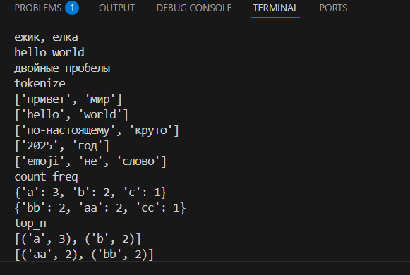

### Задание B
```python
import sys
sys.path.append('C:/Users/79032/Desktop/PYTHON_LAB/python_labb')
from scr.lib.moduls import normalize, tokenize, count_freq, top_n

a = sys.stdin.read()

norm = normalize(a)
token = tokenize(norm)
print("Всего слов:", len(token))

count = count_freq(token)
print("Уникальных слов:", len(count))

top = top_n(count)
print("Топ-5:")

for element in top:
    print(element[0], ":", element[1])
```

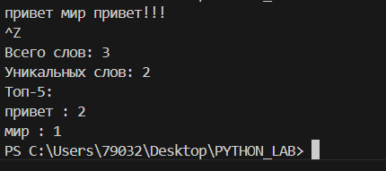

## Лабораторная работа 4
### Задание A
```python
import csv
from pathlib import Path

def read_text(path: str | Path, encoding: str = "utf-8") -> str:

    with open(path, 'r', encoding=encoding) as file:
            return ' '.join(file.read().replace("\n", ' ').split())
    
def write_csv(rows: list[tuple | list], path: str | Path, header: tuple[str, ...] | None = None) -> None:
    
    p = Path(path)
    rows = list(rows)
    
    if rows:
        expected_length = len(rows[0])
        for r in rows:
            if len(r) != expected_length:
                raise ValueError("Все строки должны иметь одинаковую длину")
            
    with p.open("w", newline="", encoding="utf-8") as f:
        w = csv.writer(f,  delimiter=',')
        if header is not None:
            w.writerow(header)
        for r in rows:
            w.writerow(r)

#мини тест
import sys
sys.path.append('C:/Users/79032/Desktop/PYTHON_LAB/python_labb')
from io_txt_csv import read_text, write_csv

txt = read_text("C:/Users/79032/Desktop/PYTHON_LAB/python_labb/data/lab04/input.txt")  # должен вернуть строку
f_csv = write_csv([("word","count"),("test",3)], "C:/Users/79032/Desktop/PYTHON_LAB/python_labb/data/lab04/check.csv")  # создаст CSV

print(txt)
print("="*20)
print(f_csv)
```
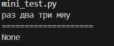


### Задание B
```python
import sys
from pathlib import Path

current_dir = Path(__file__).parent
project_root = current_dir.parent.parent 
sys.path.append(str(project_root / 'scr' / 'lib'))
from moduls import normalize, tokenize, count_freq, top_n
from io_txt_csv import read_text, write_csv


def console(text):
    tokens = tokenize(normalize(text))
    top = top_n(count_freq(tokens))
    output = f"Всего слов: {len(tokens)}"
    output += f"\nУникальных слов: {len(set(tokens))}"
    output += "\nТоп-5:"
    for word, count in top:
        output += f"\n{word}:{count}"
    return output


def from_file_to_text(path, encoding='utf-8'):
    return read_text(path, encoding=encoding)

def frequencies_from_text(text: str) -> dict[str, int]: 
    token = top_n(count_freq(tokenize(normalize(text))))
    return token

def text_to_csv(rows, path=str(project_root / 'data' / 'lab04' / 'report.csv'), header=("word", "count")):
    return write_csv(rows, path=path, header=header)

text_content = from_file_to_text(str(project_root / 'data' / 'lab04' / 'input.txt'))
text_to_csv(frequencies_from_text(text_content))
print(console(text_content))
```
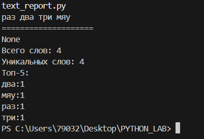

## Лабораторная работа 5
### Задание A
```python
import json
import csv

def json_to_csv(json_path: str, csv_path: str) -> None:
    """
    Преобразует JSON-файл в CSV.
    Поддерживает список словарей [{...}, {...}], заполняет отсутствующие поля пустыми строками.
    Кодировка UTF-8. Порядок колонок — как в первом объекте или алфавитный.
    """
    if not (json_path.endswith('.json')) or not (csv_path.endswith('.csv')):
        raise TypeError('Неверный тип файла')
    try:
        with open(json_path, 'r', encoding='utf-8') as jf:
            file = json.load(jf) # возвращает список словарей
        if not isinstance(file, list):
            raise ValueError("JSON должен содержать список объектов")
        if len(file) == 0:
            raise ValueError("Файл пуст или неподдерживаемая структура")
        if not isinstance(file[0], dict):
            raise ValueError("Элементы списка должны быть словарями")

        with open(csv_path, 'w', encoding='utf-8', newline='') as cf:
            writer = csv.DictWriter(cf, fieldnames=list(file[0].keys()))
            writer.writeheader()
            writer.writerows(file)

    except FileNotFoundError:
        raise FileNotFoundError("Файл не найден")

json_to_csv('C:/Users/79032/Desktop/PYTHON_LAB/python_labb/data/lab05/samples/people.json',
            'C:/Users/79032/Desktop/PYTHON_LAB/python_labb/data/lab05/out/people_from_json.csv')


def csv_to_json(csv_path: str, json_path: str) -> None:
    """
    Преобразует CSV в JSON (список словарей).
    Заголовок обязателен, значения сохраняются как строки.
    json.dump(..., ensure_ascii=False, indent=2)
    """
    if not (csv_path.endswith('.csv')) or not (json_path.endswith('.json')):
        raise TypeError('Неправильный формат файла')
    try:
        with open(csv_path, 'r', encoding='utf-8') as cf:
            file = list(csv.DictReader(cf))
        if len(file) == 0:
            raise ValueError('Файл пуст')

        with open(json_path, 'w', encoding='utf-8') as jf:
            json.dump(file, jf, ensure_ascii=False, indent=2)
    except FileNotFoundError:
        raise FileNotFoundError("Файл не найден")

csv_to_json('C:/Users/79032/Desktop/PYTHON_LAB/python_labb/data/lab05/samples/people.csv',
            'C:/Users/79032/Desktop/PYTHON_LAB/python_labb/data/lab05/out/people_from_csv.json')
```
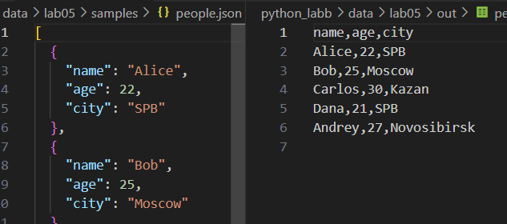
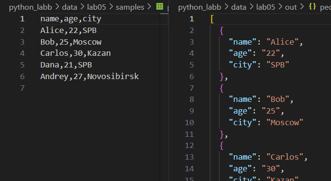


### Задание B
```python
from openpyxl import Workbook
import csv

def csv_to_xlsx(csv_path: str, xlsx_path: str) -> None:
    """
    Конвертирует CSV в XLSX.
    Использовать openpyxl ИЛИ xlsxwriter.
    Первая строка CSV — заголовок.
    Лист называется "Sheet1".
    Колонки — автоширина по длине текста (не менее 8 символов).
    """
    wb = Workbook()
    ws = wb.active
    ws.title = "Sheet1"

    with open(csv_path, encoding="utf-8") as f:
        for row in csv.reader(f):
            ws.append(row)
        for column in ws.columns:
            mx = 0
            column_letter = column[0].column_letter
            for cell in column:
                mx = max(mx, len(cell.value))
            new_width = max(mx + 2, 8)
            ws.column_dimensions[column_letter].width = new_width

        wb.save(xlsx_path)

csv_to_xlsx('C:/Users/79032/Desktop/PYTHON_LAB/python_labb/data/lab05/samples/cities.csv',
            'C:/Users/79032/Desktop/PYTHON_LAB/python_labb/data/lab05/out/cities.xlsx')
```
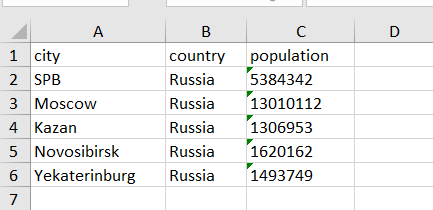

## Лабораторная работа 6
### Задание cli_text
```python
import argparse
from pathlib import Path
from scr.lib.moduls import tokenize, count_freq, top_n

def main():
    parser = argparse.ArgumentParser(description="CLI‑утилиты лабораторной №6")#Создаем парсер с описанием для справки
    subparsers = parser.add_subparsers(dest="command")#Создаем группу подпарсеров для разных команд и выбранная команда сохранится в args.command

    cat_parser = subparsers.add_parser("cat", help="Вывести содержимое файла")
    cat_parser.add_argument("--input", required=True)
    cat_parser.add_argument("-n", action="store_true", help="Нумеровать строки")

    stats_parser = subparsers.add_parser("stats", help="Частоты слов")
    stats_parser.add_argument("--input", required=True)
    stats_parser.add_argument("--top", type=int, default=5)

    args = parser.parse_args()#Парсим аргументы командной строки

    file = Path(args.input)#Создаем объект Path для работы с путём файла

    if not file.exists():#Проверяем существование файла, иначе выбрасывает исключение
        raise FileNotFoundError("Файл не найден")

    if args.command == "cat":
        # py -m scr.lab06.cli_text cat --input data/lab06/samples/text.txt -n

        with open(file, "r", encoding="utf-8") as f:
            num = 1
            for line in f:
                line = line.rstrip("\n")
                if args.n:
                    print(f"{num}: {line}")
                    num += 1
                else:
                    print(line)

    elif args.command == "stats":
        # py -m scr.lab06.cli_text stats --input data/lab06/samples/text.txt --top 5

        with open(file, "r", encoding="utf-8") as f:
            data = [row for row in f]
        data = "".join(data)

        tokens = tokenize(data)
        freq = count_freq(tokens)
        top = top_n(freq, args.top)

        print(f"Всего слов: {len(tokens)}")
        print(f"Уникальных слов: {len(freq)}")
        print(f"Топ-{args.top}:")
        for word, count in top:
            print(f"{word}: {count}")


if __name__ == "__main__":
    main()      
```
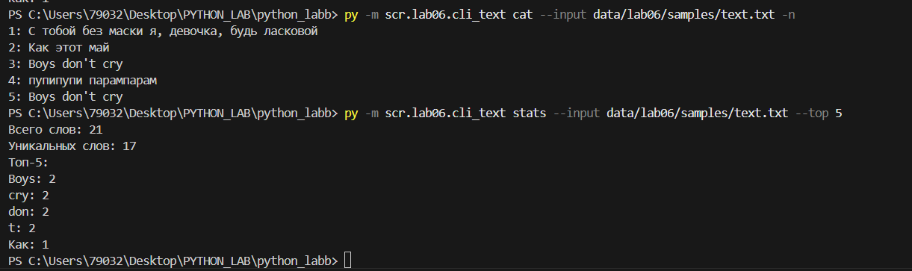
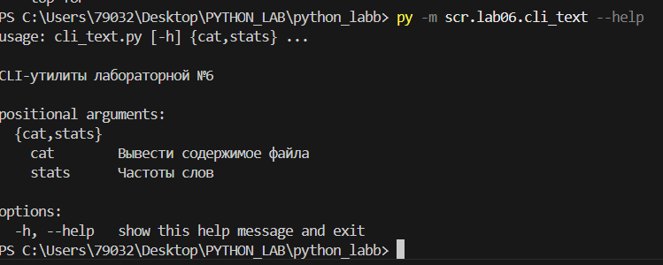


### Задание cli_convert
```python
import argparse
from scr.lab05.json_csv import json_to_csv, csv_to_json
from scr.lab05.csv_xlsx import csv_to_xlsx

def main():
    parser = argparse.ArgumentParser(description="Конвертеры данных")#Создаем основной парсер с описанием "Конвертеры данных"
    sub = parser.add_subparsers(dest="cmd")#Создаем группу подпарсеров для разных команд ,а выбор команды будет сохранен в атрибут cmd


    json_to_csv_p = sub.add_parser("json2csv", help="Перевести json в csv")#Создаем подпарсер для команды json2csv
    json_to_csv_p.add_argument("--input", dest="input", required=True, help="Входной JSON файл")
    json_to_csv_p.add_argument("--output", dest="output", required=True, help="Выходной CSV файл")

    csv_to_json_p = sub.add_parser("csv2json", help="Перевести csv в json")#Создаем подпарсер для команды csv2json
    csv_to_json_p.add_argument("--input", dest="input", required=True, help="Входной CSV файл")
    csv_to_json_p.add_argument("--output", dest="output", required=True, help="Выходной JSON файл")

    csv_to_xlsx_p = sub.add_parser("csv2xlsx", help="Перевести csv в xlsx")#Создаем подпарсер для команды csv2xlsx
    csv_to_xlsx_p.add_argument("--input", dest="input", required=True, help="Входной CSV файл")
    csv_to_xlsx_p.add_argument("--output", dest="output", required=True, help="Выходной XLSX файл")

    args = parser.parse_args()#Парсим аргументы командной строки и сохраняем в объект args

    if args.cmd == "json2csv":
        # py -m scr.lab06.cli_convert json2csv --input  data/lab06/samples/people.json  --output data/lab06/out/people2_from_json.csv
        json_to_csv(json_path=args.input, csv_path=args.output)
    elif  args.cmd == "csv2json":
        #py -m scr.lab06.cli_convert csv2json --input data/lab06/samples/people.csv --output data/lab06/out/people2_from_csv.json
        csv_to_json(csv_path=args.input, json_path=args.output)
    elif args.cmd == "csv2xlsx":
        #py -m scr.lab06.cli_convert csv2xlsx --input data/lab06/samples/people.csv --output data/lab06/out/people2_from_csv.xlsx
        csv_to_xlsx(csv_path=args.input, xlsx_path=args.output)

if __name__ == "__main__":
    main()

```
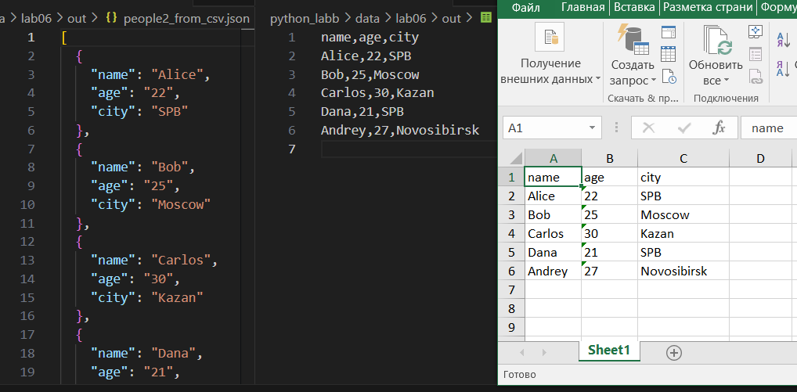
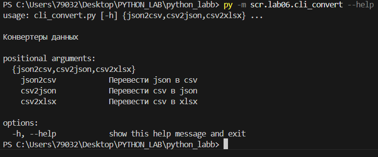

## Лабораторная работа 7
### Задание A
```python

import pytest
from scr.lib.moduls import normalize, tokenize, count_freq, top_n


@pytest.mark.parametrize(
    "scr,expected",
    [
        ("ПрИвЕт\nМИр\t", "привет мир"),
        ("ёжик, Ёлка", "ежик, елка"),
        ("Hello\r\nWorld", "hello world"),
        ("  двойные   пробелы  ", "двойные пробелы"),
    ],
)
def test_normalize(scr, expected):
    assert normalize(scr) == expected


@pytest.mark.parametrize(
    "scr,expected",
    [
        ("привет мир", ["привет", "мир"]),
        ("hello,world!!!", ["hello", "world"]),
        ("по-настоящему круто", ["по-настоящему", "круто"]),
        ("2025 год", ["2025", "год"]),
        ("emoji 😀 не слово", ["emoji", "не", "слово"]),
    ],
)
def test_tokenize(scr, expected):
    assert tokenize(scr) == expected


@pytest.mark.parametrize(
    "tokens,expected", 
    [
    (["a", "b", "a", "a", "c", "b"], {"a": 3, "b": 2, "c": 1}),
    ([], {}),
    ],
)
def test_count_freq(tokens, expected):
    assert count_freq(tokens) == expected


@pytest.mark.parametrize(
    "freq,n,expected", 
    [
    ({"a": 3, "b": 1, "c": 2}, 2, [("a", 3), ("c", 2)]),
    ({"beta": 1, "alpha": 1, "gamma": 1}, 3, [("alpha", 1), ("beta", 1), ("gamma", 1)]),
    ({"one": 2, "two": 1}, 10, [("one", 2), ("two", 1)]),
    ({"a": 1, "b": 2}, 0, []),
    ],
)
def test_top_n(freq, n, expected):
    assert top_n(freq, n) == expected

```
### Задание B
```python

import pytest
from pathlib import Path
import csv
import json
from scr.lib.json_csv import json_to_csv, csv_to_json

"""позитивчик"""

def test_csv_to_json_basic(tmp_path: Path):
    #Проверка корректной конвертации CSV → JSON
    scr = tmp_path / "people.csv"
    dst = tmp_path / "people.json"

    rows = [
        ["name", "age"],
        ["Alice", "22"],
        ["Bob", "25"],
    ]

    with scr.open("w", encoding="utf-8") as f:
        writer = csv.writer(f)
        writer.writerows(rows)

    csv_to_json(scr, dst)

    data = json.loads(dst.read_text(encoding="utf-8"))

    assert len(data) == 2
    assert data[1]["name"] == "Bob"
    assert set(data[0].keys()) == {"name", "age"}

def test_json_to_csv_basic(tmp_path: Path):
    #Проверка корректной конвертации JSON → CSV
    scr = tmp_path / "people.json"
    dst = tmp_path / "people.csv"

    data = [
        {"name": "Alice", "age": 22},
        {"name": "Bob", "age": 25},
    ]

    scr.write_text(json.dumps(data, ensure_ascii=False), encoding="utf-8")

    json_to_csv(scr, dst)

    with dst.open(encoding="utf-8") as f:
        reader = list(csv.DictReader(f))

    assert len(reader) == 2
    assert reader[0]["name"] == "Alice"
    assert set(reader[0].keys()) == {"name", "age"}

"""туда-сюда"""
def test_json_to_csv_roundtrip(tmp_path: Path):
    scr = tmp_path / "people.json"
    mid = tmp_path / "people.csv"
    dst = tmp_path / "people2.json"

    data = [
        {"name": "Alice", "age": 22},
        {"name": "Bob", "age": 25},
    ]

    scr.write_text(json.dumps(data, ensure_ascii=False), encoding="utf-8")

    json_to_csv(scr, mid)
    csv_to_json(mid, dst)

    data2 = json.loads(dst.read_text(encoding="utf-8"))

    assert data2 == [
        {"name": "Alice", "age": "22"},
        {"name": "Bob", "age": "25"},
    ]


def test_csv_to_json_roundtrip(tmp_path: Path):
    scr = tmp_path / "data.csv"
    mid = tmp_path / "data.json"
    dst = tmp_path / "data2.csv"

    rows = [
        ["city", "tsss"],
        ["Moscow", "677554335"],
        ["Paris", "5234521"],
    ]

    with scr.open("w", encoding="utf-8") as f:
        writer = csv.writer(f)
        writer.writerows(rows)

    csv_to_json(scr, mid)
    json_to_csv(mid, dst)

    with dst.open(encoding="utf-8") as f:
        result = list(csv.DictReader(f))

    assert len(result) == 2
    assert set(result[0].keys()) == {"city", "tsss"}

"""негативчик"""
def test_json_to_csv_empty_file(tmp_path: Path):
    # пустой JSON файл - ValueError
    scr = tmp_path / "bad.json"
    dst = tmp_path / "out.csv"
    scr.write_text("", encoding="utf-8")

    with pytest.raises(ValueError):
        json_to_csv(str(scr), str(dst))


def test_csv_to_json_empty_file(tmp_path: Path):
    # пустой CSV файл - ValueError
    scr = tmp_path / "bad.csv"
    dst = tmp_path / "out.json"
    scr.write_text("", encoding="utf-8")

    with pytest.raises(ValueError):
        csv_to_json(str(scr), str(dst))

def test_json_to_csv_missing_file(tmp_path: Path):
    # несуществующий JSON файл - FileNotFoundError
    scr = tmp_path / "no_file.json"
    dst = tmp_path / "out.csv"

    with pytest.raises(FileNotFoundError):
        json_to_csv(scr, dst)

def test_csv_to_json_missing_file(tmp_path: Path):
    # несуществующий CSV файл - FileNotFoundError
    scr = tmp_path / "no_file.csv"
    dst = tmp_path / "out.json"

    with pytest.raises(FileNotFoundError):
        csv_to_json(scr, dst)

```
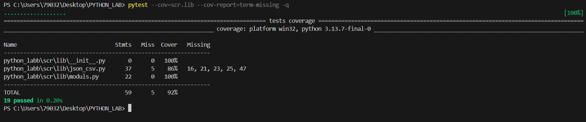
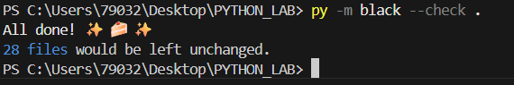

## Лабораторная работа 8
### Задание A
```python

from datetime import datetime, date
from dataclasses import dataclass


@dataclass
class Student:
    fio: str
    birthdate: str
    group: str
    gpa: float

    def __post_init__(self):
        try:
            datetime.strptime(self.birthdate, "%Y-%m-%d")
        except ValueError:
            raise ValueError("Неверный формат даты")
        
        if date.today().year < int(self.birthdate.split('-')[0]):
            raise ValueError('Год рождения больше нынешнего')
        
        if not (0 <= self.gpa <= 5):
            raise ValueError("gpa должен быть [0,5]")
        
    def age(self) -> int:
        '''возвращает количество полных лет'''
        today = date.today()
        birth_year, birth_month, birth_day = map(int, self.birthdate.split('-'))
        age = today.year - birth_year
        
        if (today.month, today.day) < (birth_month, birth_day):
            age -= 1
        return age
    
    def to_dict(self) -> dict:
        return {
            'fio': self.fio,
            'birthdate': self.birthdate,
            'group': self.group,
            'gpa': self.gpa
        }
    
    @classmethod
    def from_dict(cls, data: dict):
        return cls(
            fio=data['fio'],
            birthdate=data['birthdate'],
            group=data['group'],
            gpa=data['gpa']
        )
    
    def __str__(self):
        '''красивый вывод'''
        return f'ФИО студента: {self.fio}\n Дата рождения: {self.birthdate}\n Возраст: {self.age()}\n Группа: {self.group}\n GPA: {self.gpa}'

```
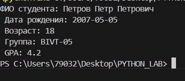
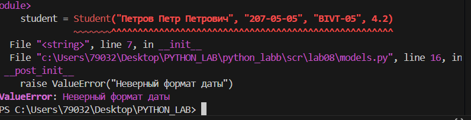


### Задание B
```python

import json
from models import Student

def students_to_json(students, path):
    data = []
    for elm in students:
        data.append(elm.to_dict())

    with open(path, "w", encoding="utf-8") as f:
        json.dump(data, f, ensure_ascii=False, indent=2)

def students_from_json(path):
    with open(path, "r", encoding="utf-8") as f:
        data = json.load(f)

    result = []
    for elm in data:
        try:
            student = Student.from_dict(elm)
            result.append(student)
        except ValueError:
            continue

    return result

```
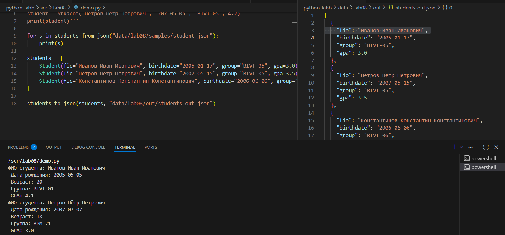

## Лабораторная работа 9
### Задание A
```python

import csv
import os
from modelss import Student

HEADERS = ['fio', 'birthdate', 'group', 'gpa']


class Group:
    def __init__(self, storage_path: str):
        self.storage_path = storage_path
        if not os.path.exists(self.storage_path):
            self._ensure_storage_exists()

    def _ensure_storage_exists(self):
        '''создать файл с заголовком, если его ещё нет'''
        with open(self.storage_path, 'w', newline='', encoding='utf-8') as file:
            csv.writer(file).writerow(HEADERS)

    def _read_all(self):
        '''прочитать все строки из CSV'''
        students = []
        with open(self.storage_path, 'r', encoding='utf-8') as file:
            reader = csv.DictReader(file)
            for row in reader:
                students.append(
                    Student(fio=row["fio"], birthdate=row["birthdate"], group=row["group"], gpa=float(row["gpa"]), )
                )
        return students

    def _write(self, students):
        with open(self.storage_path, 'w', newline='', encoding='utf-8') as file:
            writer = csv.writer(file)
            writer.writerow(HEADERS)
            for student in students:
                writer.writerow([student.fio, student.birthdate, student.group, student.gpa])


    def list(self):
        '''вернуть всех студентов в виде списка Student'''
        return self._read_all()

    def add(self, student: Student):
        '''добавить нового студента в CSV'''
        students = self._read_all()

        if any(student.fio == st.fio for st in students):
            raise ValueError('Студент уже есть')

        with open(self.storage_path, 'a', newline='', encoding='utf-8') as file:
            csv.writer(file).writerow([student.fio, student.birthdate, student.group, student.gpa])

    def find(self, substr: str):
        '''найти студентов по подстроке в fio'''
        students = self._read_all()
        for student in students:
            if substr.lower() in student.fio.lower():
                return student
            raise ValueError('Студента нет в базе')

    def remove(self, fio: str):
        '''удалить запись(и) с данным fio'''
        students = self._read_all()
        new_list_students = []
        removed_count = 0

        for st in students:
            if st.fio.lower() != fio.lower():
                new_list_students.append(st)
            else:
                removed_count += 1

        if removed_count == 0:
            raise ValueError(f'студента с ФИО: {fio} нет в базе')

        self._write(new_list_students)

    def update(self, fio, **fields):
        '''обновить поля существующего студента'''
        students = self._read_all()
        update = False
        for st in students:
            if st.fio.lower() == fio.lower():
                for key, value in fields.items():
                    if 'fio' == key:
                        st.fio = value
                    if 'birthdate' == key:
                        st.birthdate = value
                    if 'group' == key:
                        st.group = value
                    if 'gpa' == key:
                        st.gpa = float(value)
                update = True
                break
        if update:
            self._write(students)
            return True

        return False


if __name__ == '__main__':
    student = Group('C:/Users/79032/Desktop/PYTHON_LAB/python_labb/data/lab09/students.csv')
    """print(student.update("Петров петр", group="BIVT-10"))#была бивт-05
    print(student.remove("Сидорова Анна"))
    print(student.find("Петров Петр"))
    print(student.add(Student("Сидорова Анна", "2007-07-07", "BIVT-07", 4.3)))
    print(student.list())
    print(student)"""


```
# Создание файла
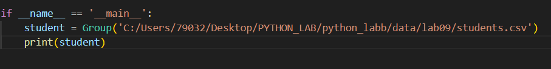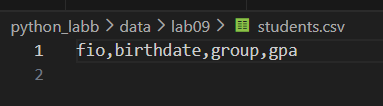
# Вывод студентов
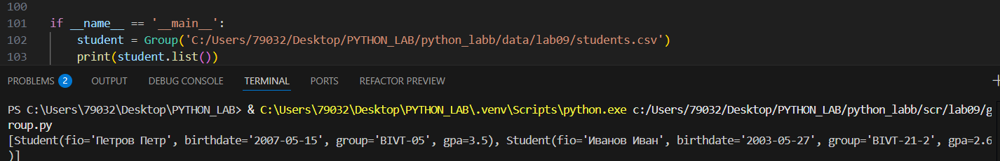
# Добавление студента
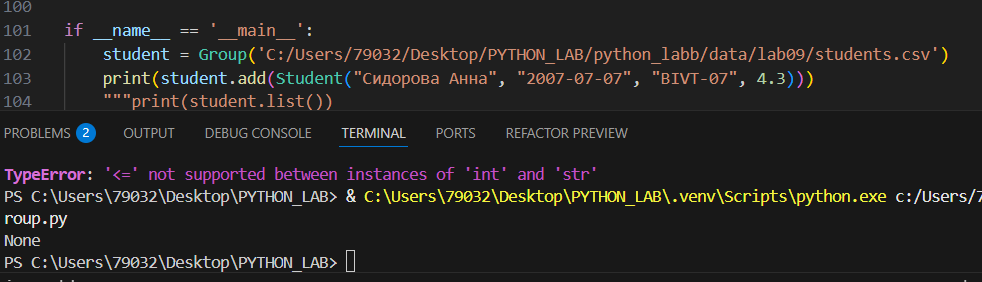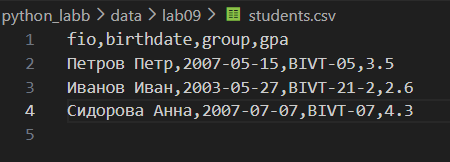
# Поиск студента
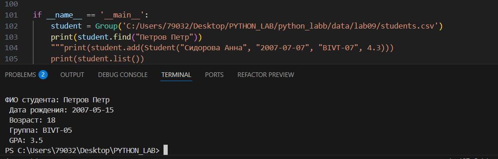
# Удаление студента
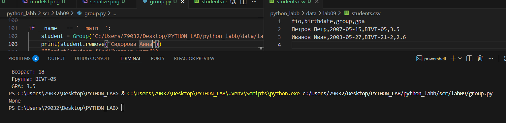
# Обновление информации студента


